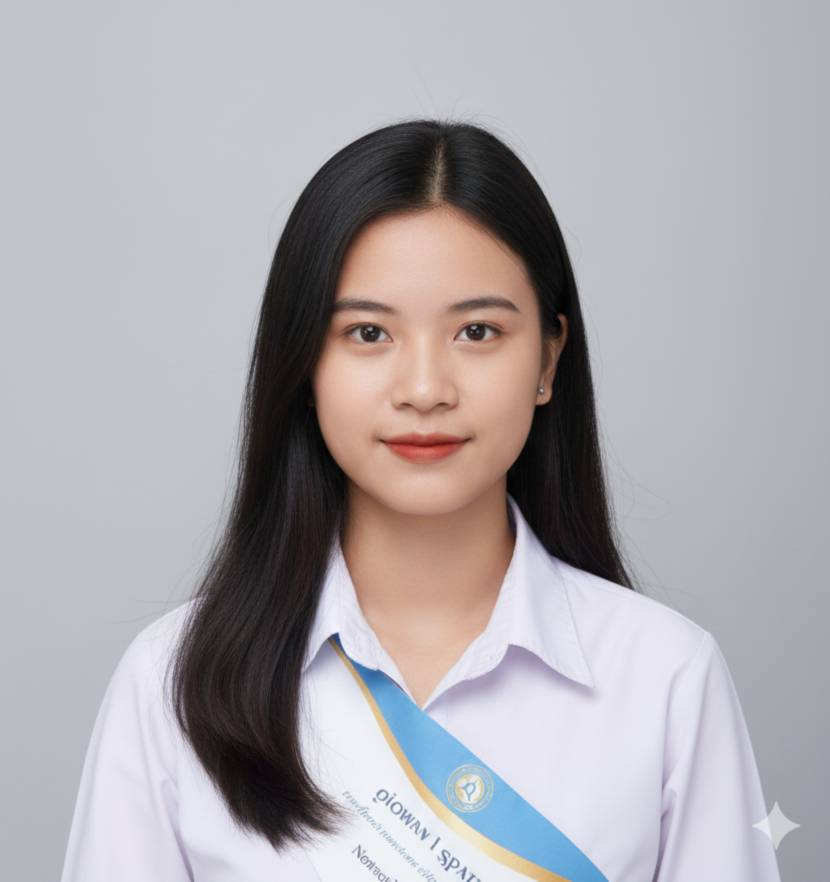

<!-- Dark Mode Portfolio CV for GitHub Profile -->

# 🌙 Hi there, I'm Ms. Phyoe Su Thein 👋

🎓 *International Business Management Student at Payap University*  
📍 *Chiang Mai, Thailand*  
💼 *Looking for Internship Opportunities in International Business / Marketing / Operations*

---

## 🏫 Education

🎓 **Payap University**  
_Bachelor of Business Administration (International Business Management)_  
📍 Chiang Mai, Thailand  
📆 Currently Studying (Expected Graduation: 2026)

🎓 **Shand Community College**  
_Associate Degree in Social Science_  
📆 Completed 2023

---

## 💼 Experience

### 👥 Team Collaboration Projects  
- Worked effectively in **team-based projects** and **volunteer events**.  
- Experienced in **planning, coordination, and communication**.  
- Comfortable collaborating in **multicultural environments**.

### 💻 Microsoft Office Proficiency  
- Fluent in **Word**, **Excel**, **PowerPoint**, and **Outlook**.  
- Skilled at creating business reports, spreadsheets, and presentations.  
- Confident in **cloud tools** such as Google Workspace and OneDrive.

---

## 🧠 Skills & Tools

---

## 🎯 Objective

> 💡 *To gain practical experience and contribute to an international business environment where I can apply academic knowledge, strengthen professional skills, and learn from real-world challenges.*

---

## 🌐 Languages

| Language | Proficiency |
|-----------|--------------|
| 🇹🇭 Thai | Native |
| 🇬🇧 English | Intermediate |

---

## 📫 Contact Me

---

✨ _“Success is not final; failure is not fatal: it is the courage to continue that counts.”_  
— *Winston Churchill*

---

